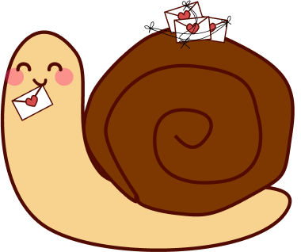

# Snail Mail

🐌 Snail Mail App - send letters across the world with a touch of nostalgia, delivered slowly like real letters.

## Motivation

I've been working on this project to create a space where users can enjoy the art of slow, meaningful communication by embracing the charm of traditional letter writing. 💌

## Key Features (so far)

1. **Simulated Delivery Time:**
   - Letters take time to "deliver," adding an element of anticipation and nostalgia, reminiscent of traditional mail.
2. **Recipient Matching:**
   - Use matching algorithm based on shared interests, language preferences, and geographical locations to enhance meaningful connections.
3. **Time Capsule Letters:**
   - A time capsule feature, allowing users to compose letters and schedule them for delivery at a future date, creating surprise and anticipation.

## Tech Stack

### React Native with Expo

I chose <u>[Expo](https://expo.dev/)</u> for this project primarily because I wanted to create an app that works seamlessly on both the web and mobile without dealing with native development tools. According to my research, Expo checked all the boxes.

Additionally, I opted for Expo due to its familiarity. Having worked on a few projects with Expo before, I enjoyed using it, making it a justified choice for this project as well.

### Supabase

For the backend/database, I'm using <u>[Supabase](https://supabase.com/)</u>. Although I've loved working with Firebase, I've been wanting to pick up Supabase for a while now. Despite a bit of a **learning curve**, I chose Supabase because of its numerous advantages over Firebase, and the fact that it's Open Source!

### Tamagui

For the overall styling of the app, I’m using <u>[Tamagui](https://tamagui.dev/)</u> as the UI Library. It’s my first time working with Tamagui, and it seems easy to integrate into the app. It's quite similar to using other frameworks like Tailwind CSS.

Tamagui also boasts great benchmarks and support for web + mobile styling, making it my preferred choice.
